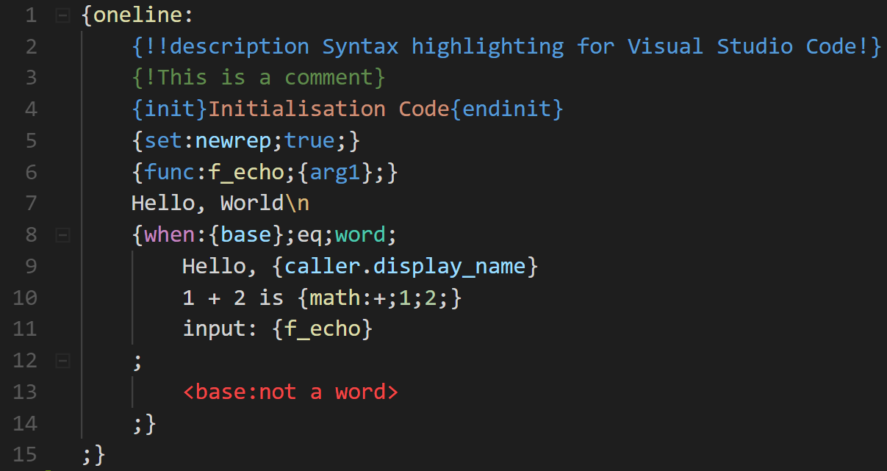
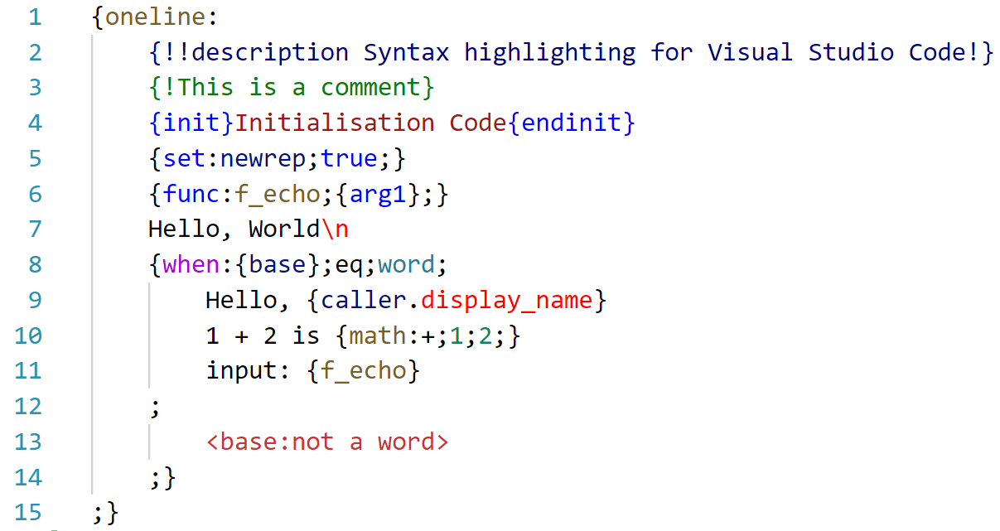

# YNA-for-VSCode

Adds syntax higlighting and auto-indenting for YNA to Visual Studio Code.  
YNA is a programming language used in tags for the popular discord bot [42](https://42.rockett.space/), by squaswin.  
42 is based on the character of the same name in the comic [Kiwi Blitz](http://www.kiwiblitz.com/) by Mary Cagle, which is also where the icon is from.

You can support both [squaswin](https://www.patreon.com/squaswin) and [Mary Cagle](https://www.patreon.com/cubewatermelon) on Patreon!

